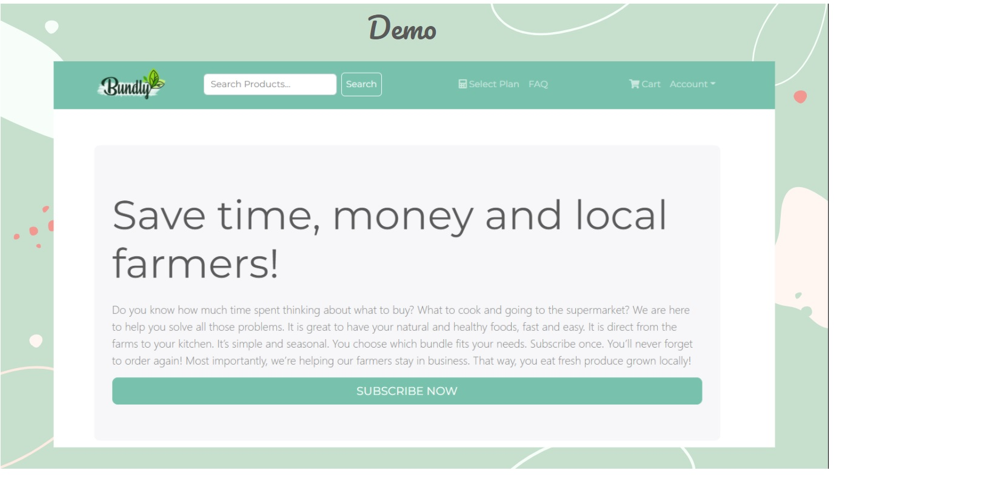

 
 

### Technology used 

React ------ Node.js ------ MongoDB

### Demo

Online Deployment of this project is available at
https://bundly29app.herokuapp.com/

## Getting Started with Create React App

This project was bootstrapped with
[Create React App](https://github.com/facebook/create-react-app).

## Available Scripts

In the project directory, you can run:

### `npm install` in the root directory & in the frontend

to install the dependancies 

## Environment Variables 

in order for this project to work you need to add a .env file the have the following variables :

NODE_ENV = development
PORT = 5000
MONGO_URI = ....
JWT_SECRET = ....
GOOGLE_CLIENT_ID = ....
FACEBOOK_CLIENT_ID = ....
SENDGRID_API_KEY = ....
SENDER_EMAIL = ....
SUBSCRIPTION_CONFIRMATION_TEMPLATE = ....
TRACK_ID=....
GOOGLE_MAP_KEY=....

### `npm run dev`

Runs the app in the development mode.\
Open [http://localhost:5000](http://localhost:5000) to view it in the browser.

#### Libraries/Frameworks

- react: React bootstrap
- react-router-dom: The router components of react
- react-icons
- react-dom:
- React GA 
- Express Async Handler
- Colors
- Nodemon
- Dotenv
- BcyrptJS
- Mongoose
- Multer
- Morgan
- Csurf
- Puppeteer